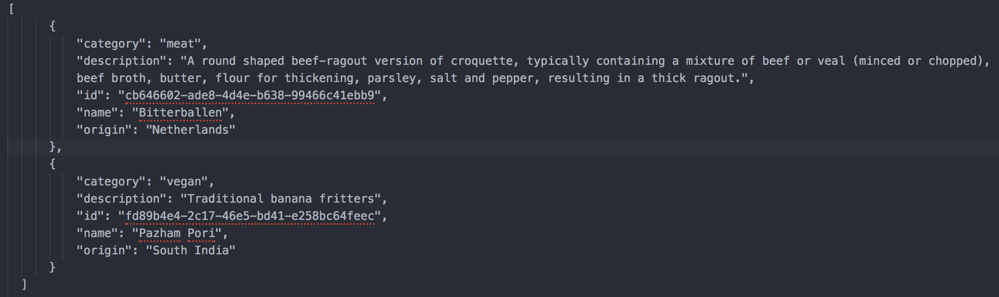

# About
A RESTful API according to an MVC architecture for Snack resource.
Snacks have 5 fields = id, name, origin, category, description.
Id that is unique across every existing resource.

## Getting started
1. Fork and clone repository
2. Run npm install
3. Run "npm run dev" or "npm start" to start the server
4. Make requests using httpie or curl.

## Requests include
GET /snacks
GET /snacks/:id
POST /snacks
PUT /snacks/:id
DELETE /snacks/:id

## Data looks like
1. An array of snack objects.

